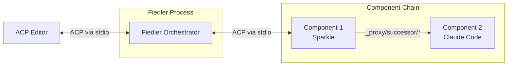
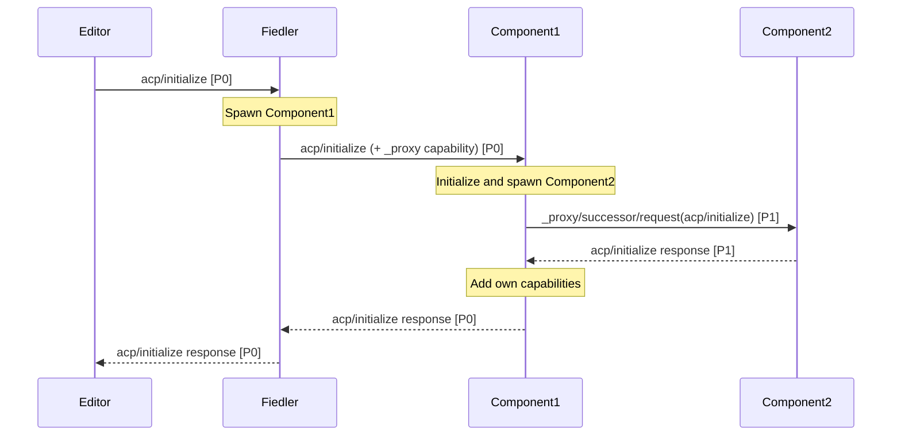

# Fiedler: ACP Conductor

{{#rfd: proxying-acp}}

**Fiedler** is the orchestrator for P/ACP proxy chains. Named after Arthur Fiedler, conductor of the Boston Pops, it coordinates the flow of ACP messages through a chain of proxy components.

## Overview

Fiedler sits between an ACP editor and a chain of components, presenting itself as a normal ACP agent to the editor while managing the proxy chain internally.



**From the editor's perspective**: Fiedler is a normal ACP agent communicating over stdio.

**From the component's perspective**: Each component is initialized by its predecessor and communicates via `_proxy/successor/*` protocol with its successor.

## Responsibilities

Fiedler has three core responsibilities:

### 1. Process Management

- Spawns component processes based on command-line arguments
- Manages component lifecycle (startup, shutdown, error handling)
- For MVP: If any component crashes, shut down the entire chain

**Command-line interface:**
```bash
fiedler sparkle-acp claude-code-acp
```

This creates a chain: `Editor → Fiedler → sparkle-acp → claude-code-acp`

### 2. Message Routing

Routes messages between editor and components:

**Editor → Component messages:**
- Messages from editor to Fiedler are forwarded to the first component
- Preserves original message ID
- First component initializes subsequent components via `_proxy/successor/*`

**Component → Component messages:**
- Components use `_proxy/successor/request` to send to their successors
- Fiedler doesn't need to route these—components talk directly via stdio pipes

**Response messages:**
- Flow back through the chain automatically via stdio
- Each component can transform responses before passing upstream

### 3. Capability Management

Fiedler modifies capability advertisements during initialization:

**When forwarding `acp/initialize` to first component:**
- Adds `_proxy/successor/*` capability if component has a successor
- Removes `_proxy/successor/*` capability if component is the last in chain
- Passes through all other capabilities from editor's request

This allows:
- Each component to see what capabilities its successor offers
- Each component to decide what capabilities to advertise to its predecessor
- The chain to be transparent to the editor

## Initialization Flow



Key points:
1. Fiedler doesn't spawn all components upfront—only the first one
2. Each component is responsible for initializing its successor
3. Message IDs are preserved when forwarding from editor
4. Components use new message IDs when talking to successors
5. Capabilities flow back up the chain, with each component adding its own

## Architecture

### Core Types

```rust
struct Fiedler {
    /// The first component in the chain
    first_component: ComponentProcess,
    /// Capabilities to advertise when initializing the chain
    proxy_capability: bool,
}

struct ComponentProcess {
    name: String,
    stdin: ChildStdin,
    stdout: BufReader<ChildStdout>,
    stderr: BufReader<ChildStderr>,
}
```

### Message Flow

Fiedler operates a simple forwarding loop:

1. **Read from editor stdin** (blocking)
2. **Parse JSON-RPC message**
3. **Special handling for `acp/initialize`:**
   - Spawn first component
   - Modify capabilities (add `_proxy/successor/*`)
   - Forward to first component
4. **All other messages:** Forward directly to first component
5. **Read from first component stdout** (blocking)
6. **Forward responses back to editor stdout**

### Concurrency Model

For MVP, use a simple threaded model:
- Main thread reads from editor stdin, writes to component stdin
- Reader thread reads from component stdout, writes to editor stdout
- Error thread reads from component stderr, logs to Fiedler's stderr

Later optimization: async I/O with tokio for better performance.

## Error Handling

### Component Crashes

If any component process exits or crashes:
1. Log error to stderr
2. Shut down entire Fiedler process
3. Exit with non-zero status

The editor will see the ACP connection close and can handle appropriately.

### Invalid Messages

If Fiedler receives malformed JSON-RPC:
- Log to stderr
- Continue processing (don't crash the chain)
- May result in downstream errors

### Initialization Failures

If component fails to initialize:
1. Log error
2. Return error response to editor
3. Shut down

## Implementation Phases

### Phase 1: Basic Routing (MVP)
- [x] Design documented
- [ ] Parse command-line arguments (component list)
- [ ] Spawn first component on `acp/initialize`
- [ ] Forward messages editor ↔ component
- [ ] Capability modification (add/remove `_proxy/successor/*`)
- [ ] Simple error handling (crash-on-error)

### Phase 2: Robust Error Handling
- [ ] Graceful component shutdown
- [ ] Better error propagation
- [ ] Retry logic for transient failures
- [ ] Health checks

### Phase 3: Observability
- [ ] Message logging/tracing
- [ ] Performance metrics
- [ ] Debug mode with message inspection

### Phase 4: Advanced Features
- [ ] Dynamic component loading
- [ ] Hot reload of components
- [ ] Multiple parallel chains

## Testing Strategy

### Unit Tests
- Message parsing and forwarding logic
- Capability modification
- Error handling paths

### Integration Tests
- Full chain initialization
- Message flow through real components
- Component crash scenarios
- Malformed message handling

### End-to-End Tests
- Real editor + Fiedler + test components
- Sparkle + Claude Code integration
- Performance benchmarks

## Open Questions

1. **Component discovery**: How do we find component binaries? PATH? Configuration file?
2. **Configuration**: Should Fiedler support a config file for default chains?
3. **Logging**: Structured logging format? Integration with existing Symposium logging?
4. **Metrics**: Should Fiedler expose metrics (message counts, latency)?
5. **Security**: Do we need to validate/sandbox component processes?

## Related Documentation

- [P/ACP RFD](../rfds/draft/proxying-acp.md) - Full protocol specification
- [Proxying ACP Server Trait](./proxying-acp-server-trait.md) - Component implementation guide
- [Sparkle Component](./sparkle-component.md) - Example P/ACP component
