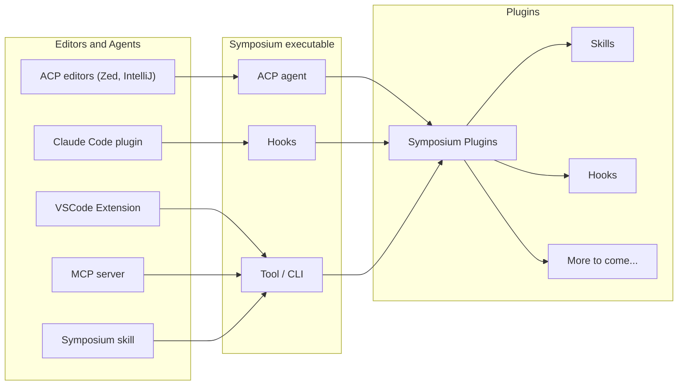

# Design overview

## Architecture

Symposium is a CLI with subcommands. All integration points connect to the same executable, but they do so in different ways:

* **ACP editors** (Zed, IntelliJ) connect to Symposium as an ACP agent or agent mod, giving full interception of agent-editor communication.
* **Claude Code** connects via a plugin that writes CC-style hooks. These hooks intercept key events and invoke the symposium executable.
* **VSCode, MCP servers, and skills** instruct the agent to invoke a symposium tool (or CLI) when it needs to do Rust things. The VSCode extension offers this tool directly to the editor's built-in agent.

All of these feed into the plugin system. Plugins provide skills, hooks, and other capabilities. Depending on the connection type, some capabilities may not be available — Symposium adapts and gracefully degrades.

## Integration tiers

Users can install Symposium in various ways, with varying degrees of capability:

* **ACP** -- The Agent Client Protocol lets us intercept everything. Maximum power.
* **Hooks** -- Claude Code plugins and systems that support hooks let us intercept key events, similar in power to ACP.
* **MCP server or Skills** -- Agent-invoked tools are maximally portable.

We vend native integrations where we can: Claude Code plugin, VSCode extension, Zed extension, IntelliJ extension, and an ACP agent in the agent registry.

## CLI subcommands

* `symposium tutorial` -- Emits a skill document for agents (and humans) on how to use the CLI
* `symposium rust` -- General Rust development guidance
* `symposium crate <name>` -- Find skills/source for the crate named `<name>`
    * `--list` -- List skills available for crates in the current dependencies
    * `--version <constraint>` -- Version constraint (e.g., `^1.0`)
* `symposium mcp` -- Run as an MCP server (stdio)
* `symposium hook [..details..]` -- Invoked from hooks
* `symposium update` -- Update plugin sources from configured repositories
* `symposium cargo` -- Run cargo with token-optimized output *(planned)*

## Plugins

A Symposium plugin is a directory with a `symposium.toml` file. Plugins can provide:

* **Skills** -- Guidance documents for agents
* **Hooks** -- Event interception and transformation
* More capabilities will be added over time

Depending on how the agent is connected, some plugin capabilities may not be available. Symposium provides graceful fallback.

## Plugin repository

Plugins are maintained in a central repository: <https://github.com/symposium-dev/recommendations>

Later, crates will be able to provide their own plugins.

## Packaging

Symposium can be packaged in several ways depending on the target environment:

* **MCP server** (`symposium mcp`) -- Exposes a `symposium` tool over stdio. The agent invokes it with command arguments (e.g., `cargo check`, `skill rust`). The MCP server installs the tutorial as its instructions so the agent knows how to use the tool.
* **ACP agent** (`symposium acp`) -- Runs as an ACP agent mod (proxy). Currently installs the MCP server above; will do more as ACP capabilities grow.
* **Hook** (`symposium hook [..details..]`) -- Invoked directly from a hook handler. Used by the Claude Code plugin and other hook-based systems.
* **Skill** -- The tutorial text packaged as a standalone skill document, with the `symposium` binary bundled alongside. No server process needed; the agent calls the CLI directly.

## Bootstrapping and updates

Claude Code skills and plugins package a `symposium.sh` bootstrap script that downloads the latest version from GitHub. Once installed, the executable checks periodically for updates. Run `symposium update` to trigger a manual update.
